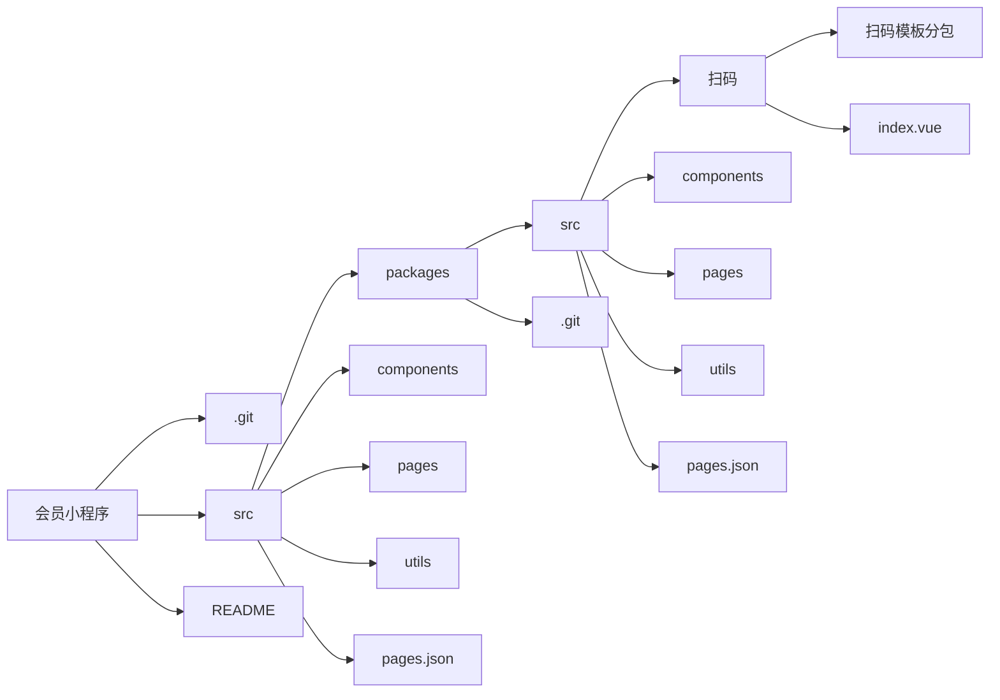

# activity-packages

uni-app小程序使用的模板、组件库。

## 起步
### 目录结构

**推荐使用typora等可视化工具查看**




1. packages以独立仓库管理不同营销模板，master分支为最终代码
2. packages仓库也是一个相对独立的项目，方便独立调试一些H5项目
3. **如果有多端（小程序和H5）需求，代码文件放在packages仓库的话，有两种import形式，以 `@/` 形式导入相关文件，这样文件会根据所在嵌体项目去导入（例如会员小程序引入插件包扫码模板，发布小程序时使用的是会员小程序的文件，发布H5则是使用packages仓库的文件，要求这个被引用的文件既要在会员小程序，也需要在packages仓库）；以 `packages/` 导入的是packages仓库的文件。**


### 装修组件

[业务端小程序接入说明](https://miduo1031.yuque.com/xbe40z/manual/nmek4g)

### 配置

项目使用`lf`作为统一换行符，vscode编辑器打开【文件】-【首选项】-【设置】，搜索`end of line`，设置为`lf`。

`prettier`会警告`crlf`，为了保持项目统一，同时`git`设置：
```bash
# 提交时转为lf，检出时不转换
git config --global core.autocrlf input
```

### 运行
在pages.json配置了哪些页面，就打包出哪些页面！在package.json增加了自定义平台配置
1. 期期抽奖+集拼图等互动营销的H5站点
```bash
yarn serve

yarn build
```
2. 上上签H5等智能营销扫码模板
```bash
yarn serve:scan

yarn build:scan
```

### vue.config.js
项目配置了路径简写，以 `packages` 对应src目录，因此 `import` 文件时可以使用
```js
import xx from 'packages/xx'
```
这样引入的文件一定是packages仓库的文件，不论是独立运行还是作为插件包在其他项目运行。而使用
```js
import yy from '@/yy'
```
则一定是导入当前项目的文件（作为独立项目运行是packages仓库的文件，作为插件包则是插件包所在项目的文件）
vue 配置 参考 [Configuration Reference](https://cli.vuejs.org/config/).

## 命名规范
1. 目录和文件名采用`kebab-case`命名
2. 类、构造函数和装饰器采用`PascalCase`命名
3. 普通函数、变量、参数采用`camelCase`命名
4. 常量推荐采用`CONSTANT_CASE`命名
5. `page.json`中`path`同文件名(`kebab-case`)
6. `vue`文件的`class`名(`name`属性)采用`PascalCase`命名
7. 导出的API接口推荐采用`camelCase`命名并以`api`作前缀，格式 `apiXxYy`

## 文件说明

### utils/index.js

封装了一些工具集等

### utils/decorator.js

装饰器集合

### utils/request.ts

通用请求，使用装饰器防重复登录，可根据业务场景修改。基于 `uni.request` 封装，理论上全端兼容，有特殊端自行根据文档调整逻辑或参数。

### mixins

- loadMoreMixin

通用**上拉加载**，由于定义了一个`getData`获取数据的方法，需要在引入`mixin`的地方自定义`getData`函数。可以定义标志变量用于防重复请求，这里采用`busy`

```js
getData() {
  if (this.busy) return
  this.busy = true
  const nextPage = this.paging.page + 1
  API({
    Page: nextPage,
    PageSize: this.paging.pageSize,
    ...this.otherParams
  }).then(res => {
    if (this.$ck(res)) {
      this.dealRes(res, nextPage)
      // 其他业务逻辑
    }
    this.busy = false
  }).catch(() => {
    this.busy = false
  })
}
```

- subscribeMsgMixin

**消息订阅**，封装了基本的`requestSubscribeMsg`。如果返回数据表示成功调起订阅界面，否则失败，失败时会自动提示。

```js
const res = await this.requestSubscribeMsg(this.noticeTempList)
// 处理用户选择的数据
if (res) {
  // 筛选允许的模板
  this.acceptList = this.noticeTempList.filter(item => res[`${item}`] === 'accept')
  // 提交允许模板
  this.uploadAcceptList()
}
```

## 提交

内置了 `Commitizen` ，用于提交规范的 `git message`，简单使用（命令式）

```bash
git add .
# 这步会出现一些交互式命令
git cz
git push origin master
```
